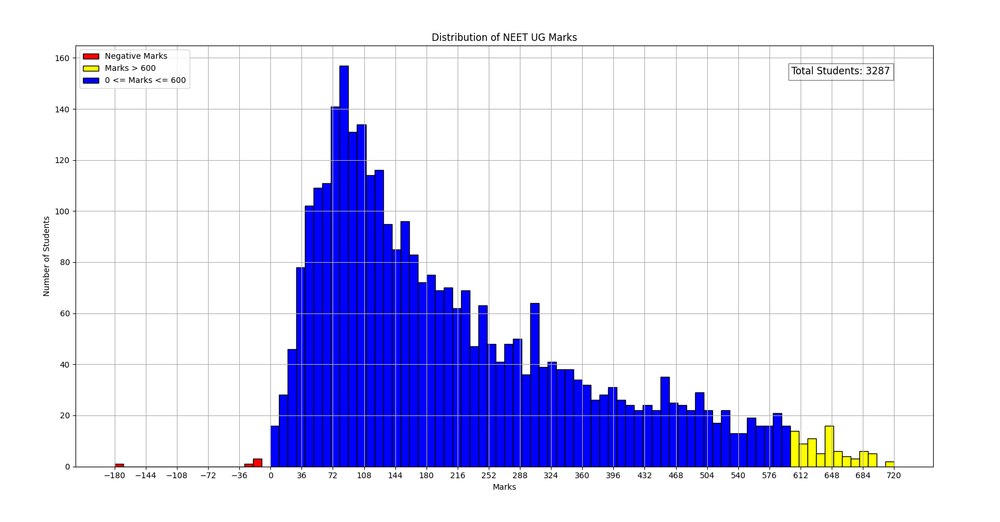

# NEET UG Marks PDF to Graph Plotter

This project is a PDF to graph plotter for NTA NEET 2024 Supreme Court requested data. It extracts marks from multiple PDF files, processes the data, and visualizes the distribution of marks using histograms.

### Sample Output

## Features

- Extracts marks data from PDF files
- Processes marks data and aggregates it
- Plots histograms for negative marks, high marks (>600), and other marks (0 to 600)
- Displays the total number of students scanned

## How it works

The script performs the following steps:

1. **ExtractedpdfMarks(pdfPath)**: Extracts marks from a single PDF file using regex to find matches for serial numbers and marks.
2. **ProcessFolder(folder)**: Processes all PDF files in the selected folder and aggregates the marks data.
3. **Visualization**: Uses `matplotlib` to plot histograms for different ranges of marks (negative, high marks, and others).

## Example Output

The script generates a histogram plot with three different colored bars representing:
- Negative marks (red)
- Marks greater than 600 (yellow)
- Marks between 0 and 600 (blue)

Additionally, the total number of students scanned is displayed on the plot.

